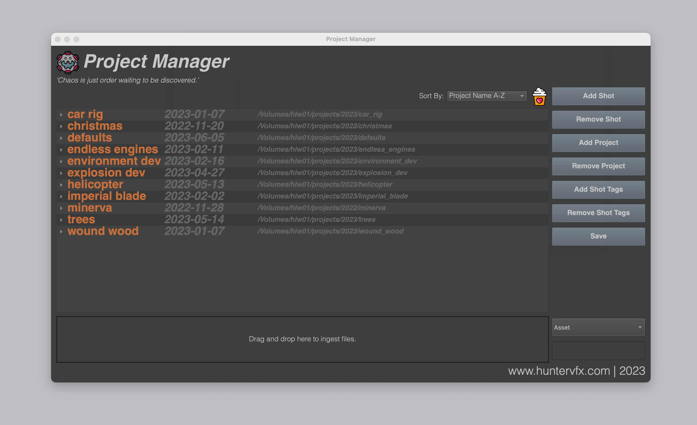

# hPipe

hPipe is a collection of tools focused around a small portable USD VFX pipeline. Currently, hPipe has hookins for nuke, houdini, and blender with more coming soon. The package centers around two databases - a project database that manages active projects and shots, and an asset database that can store different asset types: Image Sequences, USD components, ProjectFiles, and Reviewables.

## Authors

- [@Hunter Williams](https://www.github.com/hwilliamsfilm)

## Screenshots

